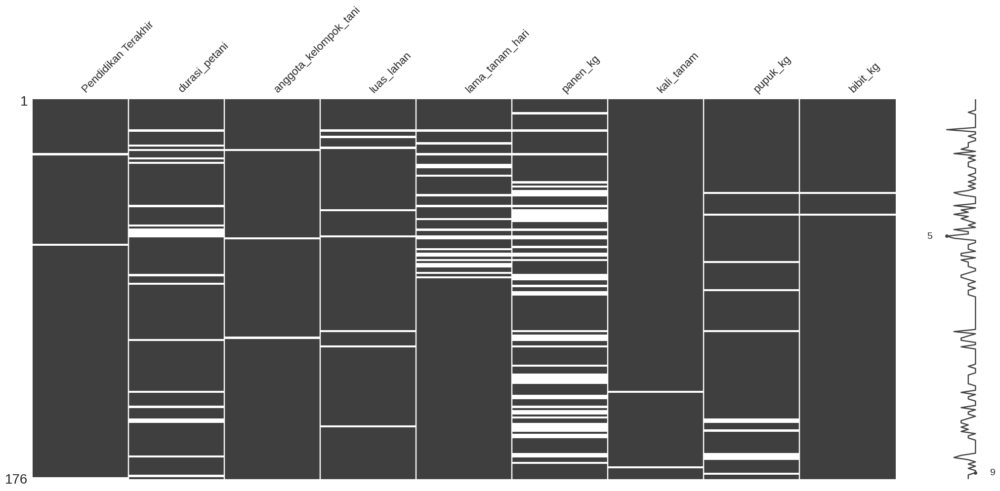
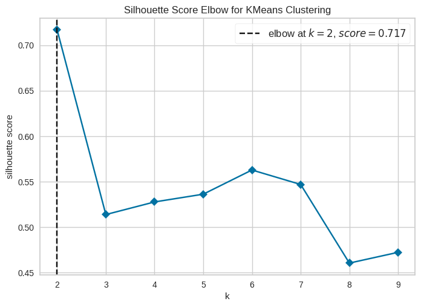
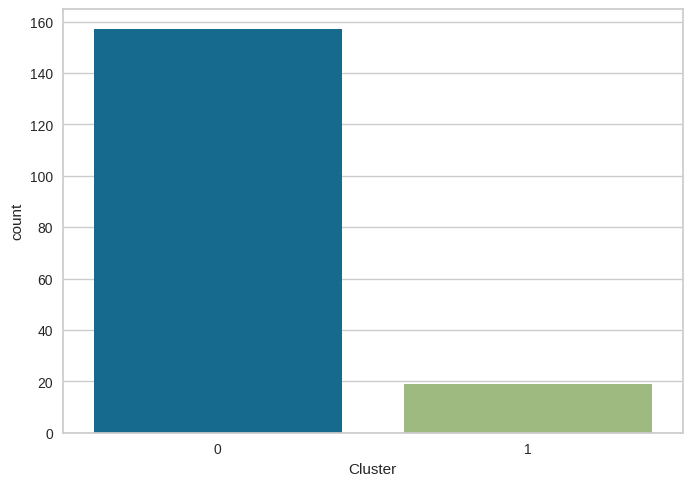
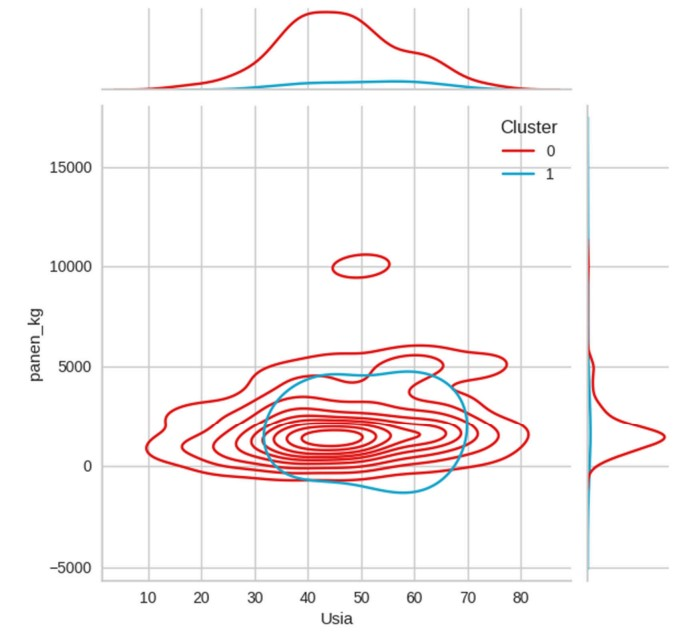
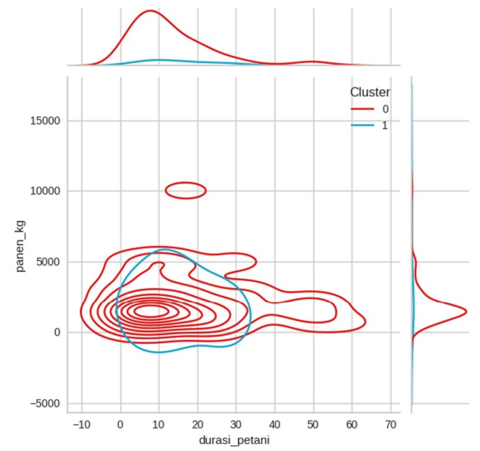

# Data Science Portfolio
#  **Segmentation Of Red Onion Farmer**
## Instructions for Running Google Colab Notebook
1. Open Google Colab with any browser. 
2. Login with your Google Account and make new notebook. 
3. Import Dataset from Google Drive, The data used is kuesioner_1.xlsx
4. Install library python if needed

### **Business Understanding**
Center Of Excellence Universitas Dian Nuswantoro mengadakan penelitian dengan petani bawang merah sebagai mitranya. Adapun dataset yang dihimpun adalah sebagai berikut :
- Pengumpulan dataset dilakukan di 5 Kabupaten di Jawa Tengah
- Dataset bersumber dari kuesioner kepada petani bawang merah
- Data kuesioner terkait profil petani dan kegiatan pertanian bawang merah
### **`Problem`**
Bagaimana mengelompokkan petani bawang merah dengan mengimplementasikan algoritma K-Means Clustering.
### **`Goals`**
Mengidentifikasi dan mengelompokkan petani bawang merah ke dalam pengelompokkan dengan tujuan mengembangkan program pelatihan dan dukungan yang disesuaikan untuk masing-masing segmen guna meningkatkan produktivitas dan keberlanjutan.
### **`Objective`**
Membangun model Machine Learning yang dapat membantu mengidentifikasi apa saja karakteristik utama yang membedakan petani pemula dari petani senior sehingga dapat diberikan bantuan dan sumber daya apa yang paling dibutuhkan oleh setiap segmen oleh stakeholder terkait

###  **Solution Strategy**
**Langkah 01. Data Preprocessing :** Pada tahap pertama ini, data akan dikumpulkan dan dipelajari. Nilai yang hilang akan diidentifikasi dan dihapus jika diperlukan. 
**Langkah 02. Exploratory Data Analysis :** proses awal dalam analisis data yang digunakan untuk memahami struktur, menemukan pola, mendeteksi anomali, menguji asumsi, dan memeriksa hubungan dalam dataset. 
**Langkah 03. Rename Field :** Proses mengubah nama kolom dalam dataset. 
**langkah 04. Handling Missing Value :** Mengisi data-data yang kosong dengan nilai konstan, mean, dan modus. 
**Langkah 05. Handling Duplicated Data :** Melakukan pengecekan apakah terdapat data duplikat atau tidak, jika terdapat data duplikat maka dilakukan drop. 
**Langkah 06. Feature Encoding :** Proses mengubah data kategorikal menjadi tipe data numerik agar dapat digunakan dalam pemrosesan data. 
**Langkah 07. Hopkins Test :** Proses menentukan apakah data Anda memiliki kecenderungan alami untuk membentuk kelompok (clusters) atau jika data tersebut tersebar secara acak. 
**Langkah 08. Elbow Method :** Dilakukan untuk menetukan jumlah cluster terbaik yang dapat digunakan untuk menghasilkan hasil cluster yang terbaik dan dapat memaksimalkan kualitas hasil cluster. 
**Langkah 09. Machine Learning Modelling :** Proses pemodelan data menggunakan algoritma tertentu dalam kasus ini menggunakan model clustering dengan algoritma K-Means. 
**Langkah 10. Interpretasi Statistic :** Proses ini membantu dalam mengevaluasi hasil clustering, menemukan pola yang menarik dengan melihat hasil cluster dengan persebaran nilai statistics

### **Exploratory Data Analysis**

`import missingno`: 
- Ini adalah proses pengecekan kolom mana saja yang terdapat value yang kosong (missing value) sehingga perlu dilakukan imputasi untuk mengisi kolom yang kosong dengan value tertentu.

### **Elbow Method**

### **K-Means Clustering**

### **Visualisasi JointPlot Usia dengan Jumlah Hasil Panen**

### **Visualisasi JointPlot Lama Bertani dengan Jumlah Hasil Panen**

**Deskripsi Petani**  
Berdasarkan persebaran statistik untuk masing-masing cluster dapat disimpulkan sebagai berikut :
- Dapat diketahui bahwa persebaran cluster 0 sebesar 157 petani dan cluster 1 sebesar 19 petani
- Dari hasil visualisasi jointplot usia dengan jumlah hasil panen bahwa petani di cluster 0 dapat menghasilkan jumlah panen lebih banyak dibandingkan dengan cluster 1 dari hal ini juga dapat dilihat bahwa cluster 0 memiliki variasi usia petani yang jauh lebih banyak dan memiliki petani dengan usia mudah hingga tua dibandingkan dengan cluster 1 yang banyak didominasi petani yang tergolong berumur.
- Dari hasil visualisasi jointplot Lama bertani dengan jumlah hasil panen bahwa  petani pada cluster 0 rata – rata telah menjadi petani selama 10 tahun, pada cluster 0 ini dapat dilihat juga bahwa anggotanya berisikan petani pemula hingga petani senior dimana petani sudah melakukan kegiatan pertanian lebih dari 30 tahun. Pada cluster 1 dapat dilihat bahwa petani telah melakukan kegiatan pertanian hingga 30 tahun lamanya sehingga dapat disimpulkan cluster 1 didominasi oleh petani pemula. Petani yang yang berusia muda atau dibawah 40 tahun memproduksi hasil panen lebih banyak apabila dibandingkan dengan petani yang berusia diatas 40 tahun yang artinya petani muda lebih produktif bila dibandingkan dengan petani yang sudah tua.

**Business Recommendations**
- Lebih memperhatikan petani di cluster 1 karena berdasarkan persebaran statistiknya cluster 1 memiliki nilai lebih rendah daripada cluster lainnya untuk setiap data pengelompokan, meskipun secara banyaknya hasil panen tidak terlalu berbeda jauh dengan cluster 0
- Rekomendasinya adalah untuk melakukan observasi lebih lanjut oleh stakeholder terkait dan memberikan pelatihan atau sosialisasi guna meningkatkan produktivitas 

